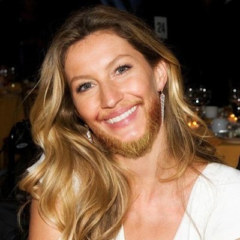
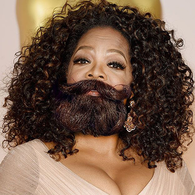
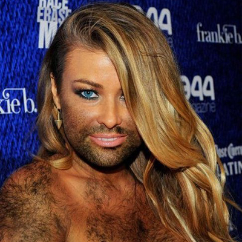

(Hairy) Friend Finder Node App

Objective:

Build a compatibility-based "FriendFinder" full-stack application. The app will take in results from user surveys, then compare the answers with other users. The app will then display the name and picture of user with best overall match. 

Utilizing Express to handle routing.

Screen Shots:

Created Logo:

Mrs. Tom Brady:

The O:

Carmen:

Heroku:
https://cryptic-harbor-92918.herokuapp.com/

Git:
https://visionzbg.github.io/friend_f_homework/
https://github.com/visionzbg/friend_f_homework

Ya'boy...

